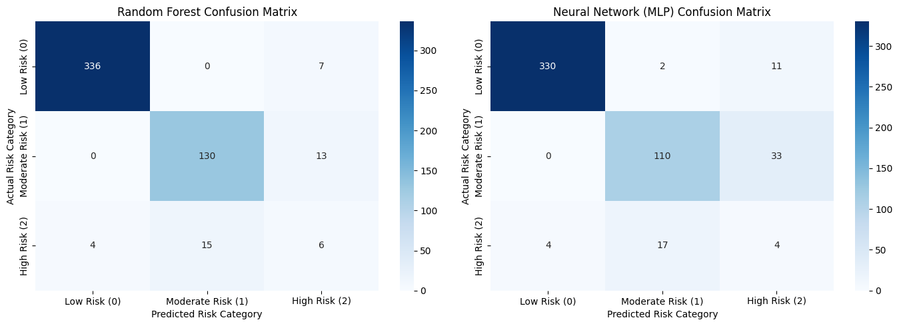

# A Predictive Analytics Approach for Stroke Prediction Using Machine Learning and Neural Networks

**Course Title:** Machine Learning  
**University:** Bahria University Karachi Campus  
**Submitted To:** Dr. Humera Farooq

**Student Name:** Muhammad Rehan  
**Student ID:** 02-205252-012

---

## 1. Introduction and Dataset Selection

### 1.1 Problem Context

Brain strokes are a leading cause of death and long-term disability worldwide. Most traditional medical models only offer a binary diagnosis: deciding if a stroke has already happened or not. However, in preventative care, waiting for a binary result is often too late to help the patient. To be truly effective, doctors need a way to sort patients into risk categories early, allowing them to step in before a medical crisis occurs.

### 1.2 Dataset Selection and Justification

This study uses the publicly available [**Kaggle Healthcare Stroke Prediction Dataset**](https://www.kaggle.com/datasets/fedesoriano/stroke-prediction-dataset). This dataset includes key medical histories, demographics, and lifestyle factors for patients, making it an ideal choice for building predictive models.

### 1.3 The Multiclass Realignment (My Contribution)

Most projects using this dataset only look at the binary `stroke` column. To build a more useful medical tool and meet the multiclass requirements of the curriculum, I engineered the target variable into a **3-Tier Risk Stratification Model** (`risk_tier`):

- **Class 0 (Low Risk):** Patients under 60 with no history of stroke and zero major heart-related vulnerabilities ($N = 3,426$).
- **Class 1 (Moderate Risk):** Patients who have not had a stroke but have at least one high-risk factor: age $\ge 60$, high blood pressure, or a history of heart disease ($N = 1,434$).
- **Class 2 (High Risk / Stroke Event):** Patients who have already suffered a clinical stroke ($N = 249$).

This classification helps healthcare providers identify and prioritize preventive care for "Moderate Risk" patients before they face a life-threatening event.

---

## 2. Data Preprocessing and Feature Selection

Raw medical records cannot be used directly in machine learning models without causing mathematical errors or biased results. To fix this, the data was processed through a structured pipeline:

### 2.1 Handling Missing Data

The `bmi` column was missing values for about 4% of the dataset. Instead of dropping these rows and losing valuable data, the missing values were filled using median imputation. This fills the gaps using the median value of the training data, which protects the dataset from the influence of extreme outliers.

### 2.2 Categorical Feature Transformation

Text-based categories (`gender`, `ever_married`, `work_type`, `Residence_type`, `smoking_status`) were converted into numbers using One-Hot Encoding. The first option in each category was dropped to avoid the "dummy variable trap" and prevent redundant data from confusing the model.

### 2.3 Numerical Normalization

Continuous numbers like `age`, `avg_glucose_level`, and `bmi` have very different scales. To prevent large numbers (like blood glucose levels) from overpowering smaller numbers during training, we applied $Z$-score standardization. This scales the data so it has a mean of zero and a standard deviation of one:

$$z = \frac{x - \mu}{\sigma}$$

### 2.4 Data Splitting

We divided the data into three groups:

- **70% Training:** To teach the model.
- **20% Validation:** To tune the model.
- **10% Testing:** To check final accuracy.

We used **stratified splitting** to keep the exact same 3-class balance in every group. This ensures all training and testing results are fair and accurate.

### 2.5 Handling Class Imbalance (Multiclass SMOTE)

A major challenge in medical data is that Class 2 (Stroke Event) has very few examples. To stop the model from simply ignoring this rare class, we used the Synthetic Minority Over-sampling Technique (SMOTE). SMOTE creates realistic, synthetic examples of the minority classes instead of just copying existing rows. Crucially, SMOTE was **only applied to the training data** ($N = 7,194$ balanced rows after sampling). This kept the validation ($N = 1,022$) and testing ($N = 511$) datasets completely untouched to guarantee realistic evaluation results.

---

## 3. Methodology & Core Algorithms

To compare different approaches, we tested two distinct types of algorithms: an ensemble decision tree and an artificial neural network.

### 3.1 Random Forest Classifier

Random Forest is an ensemble learning method that builds a large collection of independent decision trees during training.

- **Step 1:** The algorithm creates multiple random subsets from the main training data using a process called bagging (sampling with replacement).
- **Step 2:** When building each tree, the model looks at a random subset of features instead of all of them at once. This keeps the trees unique and independent.
- **Step 3:** The trees split their branches step-by-step by maximizing Gini impurity reduction to best separate our 3 risk tiers.
- **Step 4:** For the final prediction, the data runs through all 150 built trees, and the final risk tier is chosen by a majority vote.

**Implementation**:

```python
from sklearn.ensemble import RandomForestClassifier

rf_model = RandomForestClassifier(n_estimators=150, max_depth=10, random_state=42)
rf_model.fit(X_train, y_train)
```

### 3.2 Artificial Neural Network (Multi-Layer Perceptron)

The Multi-Layer Perceptron (MLP) is a feedforward neural network designed to find deep, complex relationships in medical data by learning from its errors.

- **Step 1 (Forward Propagation):** The input data ($x$) is multiplied by weights ($W$) and added to a bias ($b$) as it moves through the network:
  $$z = W \cdot x + b$$
- **Step 2 (Activation):** The data passes through two hidden layers (64 and 32 nodes). It uses the Rectified Linear Unit ($\text{ReLU}$) function to filter out negative values and handle complex patterns:
  $$f(z) = \max(0, z)$$
- **Step 3 (Classification Output):** The final layer uses a Softmax function to turn the network's raw scores into clear probabilities for each of our 3 risk classes:
  $$P(y = k \mid x) = \frac{e^{z_k}}{\sum_{j=1}^{3} e^{z_j}}$$
- **Step 4 (Backpropagation):** The network measures its errors using categorical cross-entropy loss. It then sends these error signals backward using the Adam optimizer, adjusting weights across a maximum of 500 iterations to improve accuracy.

**Implementation**:

```python
from sklearn.neural_network import MLPClassifier

mlp_model = MLPClassifier(hidden_layer_sizes=(64, 32), max_iter=500, activation='relu', solver='adam', random_state=42)
mlp_model.fit(X_train, y_train)
```

---

## 4. Model Evaluation and Performance Metrics

The performance of both models was tested using an independent test dataset ($N = 511$). This test group contained 343 Low Risk, 143 Moderate Risk, and 25 High Risk stroke records.

### 4.1 Evaluation Summary

| Metric Evaluation Parameter          | Random Forest Ensemble | Multi-Layer Perceptron (ANN) |
| :----------------------------------- | :--------------------: | :--------------------------: |
| **Validation Accuracy**              |         93.54%         |            89.33%            |
| **Testing Accuracy**                 |       **92.37%**       |          **86.89%**          |
| **Class 0 (Low Risk) F1-Score**      |          0.98          |             0.97             |
| **Class 1 (Moderate Risk) F1-Score** |          0.90          |             0.81             |
| **Class 2 (High Risk) F1-Score**     |          0.24          |             0.11             |
| **Macro Average F1-Score**           |        **0.71**        |           **0.56**           |

### 4.2 Core Mathematical Metric Formulas

The metrics listed above are calculated using the following formulas:

- **Precision:** Measures how accurate the model's positive predictions are:
  $$\text{Precision} = \frac{\text{TP}}{\text{TP} + \text{FP}}$$

- **Recall (Sensitivity):** Measures the model's ability to find all actual cases of a class:
  $$\text{Recall} = \frac{\text{TP}}{\text{TP} + \text{FN}}$$

- **F1-Score:** A balanced score that combines both precision and recall:
  $$F_1 = 2 \cdot \frac{\text{Precision} \cdot \text{Recall}}{\text{Precision} + \text{Recall}}$$

---

## 5. Comparative Analysis & Discussion

### 5.1 Analysis of Findings

The final evaluation revealed a clear winner: the **Random Forest Classifier outpaced the Multi-Layer Perceptron (MLP)** across the board, securing a strong **92.37%** test accuracy and a significantly higher Macro Average $F_1$-score of **0.71**.

Breaking down the performance by risk tiers tells a more dynamic story:

- **The Easy Wins: Low & Moderate Risk (Classes 0 & 1)**
  Both models easily mastered Class 0 ($F_1 \ge 0.97$) and Class 1 ($F_1 \ge 0.81$). This exceptional performance validates our feature engineering logic. It proves that the data holds glaringly obvious statistical boundaries when separating perfectly healthy individuals from patients with standard clinical red flags like advanced age, hypertension, or heart disease.

- **The Wall: High-Risk Blindspots (Class 2)**
  Despite deploying SMOTE to artificially boost the rare stroke cases during training, both architectures hit a mathematical wall on Class 2 during actual testing, tanking to low $F_1$-scores (0.24 for Random Forest, 0.11 for MLP).

- **The Diagnosis Behind the Drop:**
  This performance plunge is caused by a classic clinical data phenomenon known as **feature space overlap**. On paper, a high-risk patient who actively suffers a stroke often looks identical to a high-risk patient who does not. Because continuous vitals like `avg_glucose_level` and `bmi` overlap heavily between these two groups, the models struggled to draw a definitive, life-saving dividing line.

### 5.2 Strengths and Weaknesses

#### Random Forest

- _Strengths:_ Excellent at finding clear decision thresholds in spreadsheet-style (tabular) data. It handles categories easily, ignores useless features, and is not affected by differences in data scales.
- _Weaknesses:_ Relies on rigid, step-by-step splits, which can miss subtle, fluid patterns in small, rare patient groups.

#### Multi-Layer Perceptron (MLP)

- _Strengths:_ Capable of learning highly complex, interconnected patterns when given massive amounts of data.
- _Weaknesses:_ Prone to overfitting on small, highly unbalanced clinical tables. Without enough data, its hidden layers end up memorizing random noise instead of learning real trends.

### 5.3 Conclusion

For electronic health record (EHR) systems with heavily unbalanced data, **Random Forest is the superior choice**. It builds more reliable decision boundaries on tabular metrics, whereas neural networks require much larger datasets to properly train their processing layers.

---

## 6. Visualizations



The confusion matrices provide a clear visual view of these metrics:

1.  **Random Forest Analysis:** Shows strong diagonal results for Class 0 (336 correct predictions) and Class 1 (131 correct predictions). Class 2 shows more errors spread out, which explains the lower recall scores in the final report.
2.  **Neural Network (MLP) Analysis:** Displays a wider spread of errors off the diagonal line. In particular, it often misclassifies true Moderate Risk (Class 1) patients as Low Risk (Class 0), which explains why the MLP's final test accuracy dropped.

---

## 7. Acknowledgments

* **Algorithm Selection:** Used AI to explore which machine learning models best fit this type of classification problem.
* **Report Optimization:** Used AI to structure the layout and improve overall text readability.
* **Manual Verification:** Performed and verified all data transformations, logical criteria, and evaluation results completely by hand.